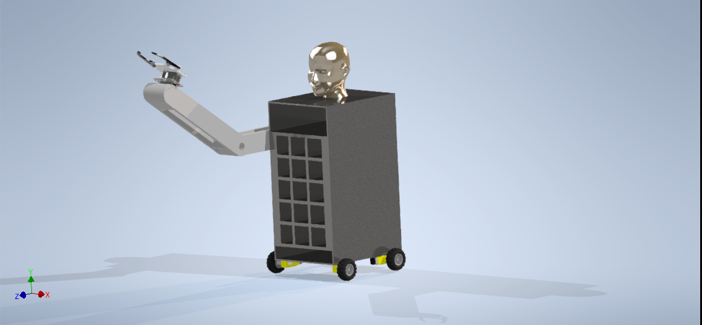
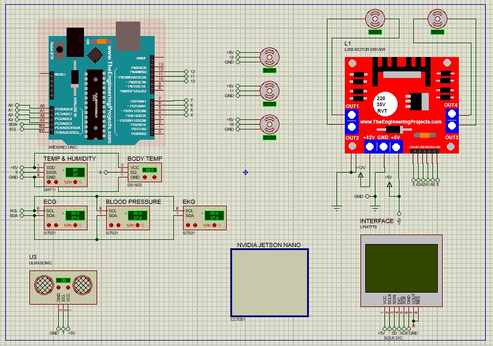

# Design of an Automatic Nurse Assitant - Design of Mechatronics Systems 1

[](https://github.com/KelvinGitu/Design-of-an-Automatic-Nurse-Assitant/issues)


## This project is done by:

1. Kelvin Gitu ENM221-0058/2017
2. Rodney David ENM221-0091/2017

## Automated Hospital Nurse Assistant

The main mechanical assembly can be seen from here:



The main electrical assembly can be seen from here:



In this work, we describe the design of an automated nurse assistant robot to help specifically clinical nurse specialists and family nurse practitioners. This nurse assistant will not replace nurses but will be able to help out with basic services such as delivering drugs to the patient, recording medical history and symptoms, monitor patient health and record signs and symptoms and educate patients about their illness and health. The purpose of our design is to allow doctors and nurses to focus on actual patient care instead of routine tasks. Another purpose of our nurse assistant design is to reduce the strain hospitals face due to a shortage of personnel. We also hope to achieve a comprehensive reduction in the risk health providers face when tackling serious infections such as Coronavirus, Tuberculosis and Ebola. The nurse assistant will take charge of close contact with patients infected with the virus in operations that do not require the input of a doctor or nurse, such as the delivery of drugs and patient education on illness, treatment and medication.
Our design will be able to achieve the above functions if deployed accordingly. However, in order to meet all client needs, we need to ensure that non-functional requirements are also met. For instance, our design will have storage capacity adequate enough to serve multiple patients in one go. Our design will also be able to run for more than twenty fours hours without failure, enhancing its reliability and availability. Since our design will be applied in an environment not associated with technological minds, we will make sure it is easy to use, giving the nurse and other hospital time an easy experience. This will be accomplished using a user interface. Our design will also be able to have a humanoid face in order to enhance our conversations with the patient. Since our design will be storing user data, it is imperative that this information is secure, which will precipitate our inclusion of encryption into the systems’ software. Database security must meet HIPPA requirements. The size of our design will be small enough to occupy the same space as hospital practitioners and patients without limiting the free movement of people. Most importantly we would want our design to be able to be fabricated locally. This would enhance its widespread adoption into the market, thus making it feasible for most hospitals to include it

## Conclusion

From our initial objectives, we were able to produce a nurse assistant that can help nurses deliver drugs to the patient, help monitor the health status of the patient and also help educate patients on their illness, health, treatment and medication. Our design is structured in such a way that it will accomplish the set functions. It will navigate freely in a hospital, even going in and out of lifts. It will help both patients and hospital staff by having the capability to dispense drugs when required as well as monitor patient health. Another important aspect of the hospital experience for patients will be our design’s capability to engage in educational conversation. Our design will not only be able to engage in the technical aspect of hospital functions but also the social aspect that most robots lack. This is achieved using artificial intelligence, which is the gateway to further technological developments. When our design is incorporated into the health care system, it will be able to offset the dire shortage of nurses and other health workers, especially during the ongoing COVID-19 pandemic. Furthermore, our design is a mechatronic design.

## Project structure

```
.
├── LICENSE
├── README.md
├── src
│   ├── Design
│   │   ├── 10Screw92005A120.ipt
│   │   ├── 14Screw92005A124.ipt
│   │   ├── 20Screw92005A128.ipt
│   │   ├── arm1b.ipt
│   │   ├── arm1.ipt
│   │   ├── arm2.ipt
│   │   ├── claw2.ipt
│   │   ├── Dock bot1 V2.ipt
│   │   ├── Dock bot2.ipt
│   │   ├── Dock top2 V2.ipt
│   │   ├── door_front.ipt
│   │   ├── door.iam
│   │   ├── gearb2a.ipt
│   │   ├── gearb2b.ipt
│   │   ├── humanoid_head.ipt
│   │   ├── left_hinge.ipt
│   │   ├── LNut90576A102.ipt
│   │   ├── lockfile.lck
│   │   ├── mainAssembly.png
│   │   ├── mainbox.ipt
│   │   ├── motor.ipt
│   │   ├── Nut90591A121.ipt
│   │   ├── OldVersions
│   │   │   ├── 10Screw92005A120.0003.ipt
│   │   │   ├── 20Screw92005A128.0003.ipt
│   │   │   ├── arm1.0001.ipt
│   │   │   ├── arm2.0005.ipt
│   │   │   ├── wheel.0001.ipt
│   │   │   ├── wheel_assembly.0003.iam
│   │   │   ├── wheel_bar.0001.ipt
│   │   │   ├── wheel_rim.0001.ipt
│   │   │   └── wheel_tube.0001.ipt
│   │   ├── packngo.log
│   │   ├── pan cross head_am_B18.6.7M - M2 x 0.4 x 10 Type I Cross Recessed PHMS --10N.ipt
│   │   ├── right_hinge.ipt
│   │   ├── _Robotic Arm With Sensor.iam
│   │   ├── _Robotic Arm With Sensor.ipj
│   │   ├── _Robotic Arm With Sensor.ipj.old
│   │   ├── ser Horn.ipt
│   │   ├── servo_arm.ipt
│   │   ├── servo_motor.ipt
│   │   ├── spacer 10mm.ipt
│   │   ├── spacer 19mm.ipt
│   │   ├── spacer 6mm.ipt
│   │   ├── TOWER PRO MG-995, ANALOG SERVO, BODY, BOTTOM.ipt
│   │   ├── TOWER PRO MG-995, ANALOG SERVO, BODY, MIDDLE.ipt
│   │   ├── TOWER PRO MG-995, ANALOG SERVO, BODY, TOP.ipt
│   │   ├── TOWER PRO MG-995, ANALOG SERVO, CONNECTOR.ipt
│   │   ├── TOWER PRO MG-995, ANALOG SERVO.iam
│   │   ├── TOWER PRO MG-995, ANALOG SERVO, SHAFT.ipt
│   │   ├── wheel_assembly.iam
│   │   ├── wheel_bar.ipt
│   │   ├── wheel.ipt
│   │   ├── wheel_rim.ipt
│   │   └── wheel_tube.ipt
│   ├── Electrical
│   │   ├── Backup Of Wheels.pdsbak
│   │   ├── wheels
│   │   │   ├── Backup Of New Project.pdsbak
│   │   │   ├── Backup Of wheels.pdsbak
│   │   │   ├── Last Loaded New Project.pdsbak
│   │   │   ├── Last Loaded wheels.pdsbak
│   │   │   ├── Screenshot 2021-08-08 231304.jpg
│   │   │   ├── wheels.HGL
│   │   │   ├── wheels.PDF
│   │   │   ├── wheels.pdsprj
│   │   │   └── wheels.pdsprj.DESKTOP-U93F1QC.0x6f736f646f.workspace
│   │   ├── Wheels.pdsprj
│   │   └── Wheels.pdsprj.DESKTOP-U93F1QC.0x6f736f646f.workspace
│   ├── hand_gear.ipt
│   └── lockfile.lck
└── tree.md
```
